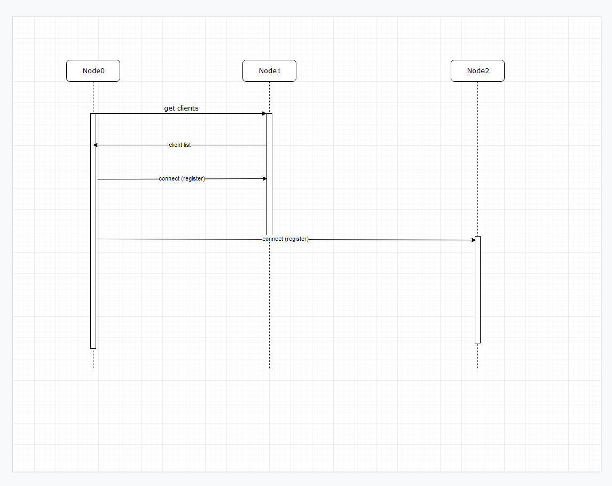
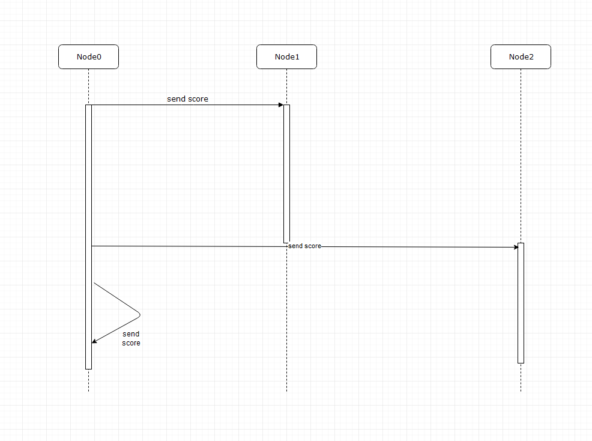

## Report for Task 1

### Purpose and code functionality

The application is a competitive cookie clicker. It is an open source project written using JavaScript. We suggest you give it a try with your favorite friends at one of those cool LAN-parties everyone is always talking about, and see who is the reigning cookie clicker champion of the squad!

The minimum amount of players needed for playing our game is 1, but we recommend to have at least 2 players for the satisfaction of feeling superiority over someone else.  In theory, the maximum amount of players is infinite, but in practice, we know most people don't have that many friends available, even for a super cool LAN-party.

The best way to enjoy our adrenaline-packed competitive experience is to play it at LAN-parties, mainly to avoid having the attempted connections of the application being blocked by firewalls and Network Address Translation.

### System design

The system has been designed to be symmetric, which means that we do not have separate code for both server and client. All the clients will be using the same code, creating only one kind of instances.

To connect to a game, the player needs to know the IP and port of one other player, for this known player to forward the information about the network to the joining player.

When connecting to the game, the client receives the list of clients and scores from another client. After having received the score and the client list, the client registers with the other clients based on the list of clients. The client registers using IP address, port, name and ID. This will allow for the existing clients to add the information of the new player to their list of clients who are currently participating in the game.

The system updates the score whenever a new player joins. Otherwise there is no synchronization regarding the score tally.

When disconnecting from the game, the client sends the disconnect to the disconnecting client, as well as the others.

### Problems encountered, lessons learned

We are aware of the fickleness of users, and are aware that we cannot expect the user will behave as we have expected the user to behave. For example, our system is suspectible to the user force closing the application, instead of using the "disconnect" option in the application. This will have implications regarding the monitoring of the score in the state of the system.

There are many more states that could be anticipated at the start of the design process, when designs are made. This brings complexity to the system, that should rigorously be either modeled or tested with sufficiently many (such as &infin; - 1) simultaneous users

In regard to cheating, we have expected, that the user would behave optimally in relation to the goals of the system - participating as a competitor in a competition about who is the best cookie clicker of the squad. We have not implemented any kind of restrictions into the system related to dissuade disruptive behaviour. We are expecting players to honor the spirit of the competition, and not engage in unwanted conduct. We are not using any auditing system for validating the ongoing score at any point of time.

This brings some risks, as everything happens in the cilent, where no instance has any auditing power regarding the state of the scoring system over others. This implies, that a forged list of scores could be perpetuated throughout the system, would a malicious user edit their score list manually. They could get a way with poisoning the other clients with an advantageous score towards themselves, or any other player.

One particular challenge regarding Macintosh is, that docker does not run native on a Macintosh. So our application does not work on Macintosh as the documentation may suggest.

There were also some additional challenges regarding reading the command line.

### Instructions for installation and execution

See the README.md in the root directory

### Implementation questions

1. What is the average time for sending 50 messages between two nodes?

2. What is the average time for sending 25 messages?

3. For a unique payload, measure the inter arrival rate between messages

4. How reliable is the architecture? What kind of applications can benefit from this architectural flavor?
